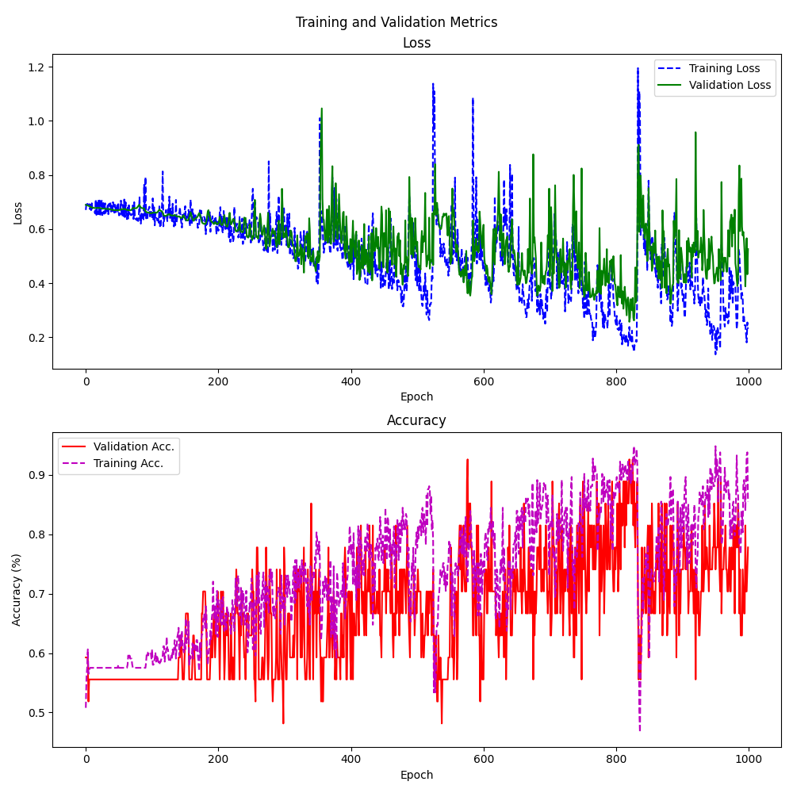

# TrajNet

This repository contains the code for TrajNet, a model designed for classifying cell behavior in intravital microscopy data as set out in Cell Behavior Video Classification Challenge (CBVCC). It offers an integrated pipeline that performs cell segmentation, tracks cell movement over time, and classifies different types of cellular behaviors. 
## Installation

### Prerequisites
- CUDA-capable GPU (recommended)
- Conda package manager

### Setup Environment

1. Clone the repository:
```bash
git clone https://github.com/lxfhfut/TrajNet.git
cd TrajNet
```

2. Create and activate the conda environment ($${\color{red}cbvcc.yml}$$ for MacOS, $${\color{green}cbvcc\\_linux.yml}$$ for Linux):
```bash
conda env create -f cbvcc.yml
conda activate cbvcc
```

## Usage

The program supports three modes of operation: train, evaluate, and predict.

### Training Mode

Train a new model on your dataset:

```bash
python main.py train \
    --root_dir ./dataset \
    --ckpt_dir ./models \
    --segmenter cyto_retrained \
    --batch_size 32
```

Parameters:
- `--root_dir`: Directory containing training videos and annotations
- `--ckpt_dir`: Directory to save model checkpoints (default: ./models)
- `--segmenter`: Cellpose model for segmentation (default: cyto_retrained)
- `--batch_size`: Training batch size (default: 32)


## Expected Directory Structure

```
dataset/
│── imgs/
│   └── 00_1/
│       ├── 000000.png
│       ├── 000001.png
│            ...
│       └── 000019.png
│   └── 00_2/
├── trks/
│   └── cyto_retrained/
│       ├── 00_1/
│       │   ├── video1_imgs.tif
│       │   ├── video1_msks.tif
│       │   └── video1_track_trajectories.csv
│       └── 00_2/
├── predict.csv
├── test_phase1.csv
└── train.csv
```
where \
-`imgs` folder stores the frames of all videos. \
-`trks` folder stores the segmentation and tracking results of videos (can be re-generated by running segment.py and track.py). \
-`train.csv` contains the video ids and labels of the training dataset.\
-`test_phase1.csv` contains the video ids and labels of the 'test_phase1' dataset.\
-`predict.csv` contains the video ids and labels (set to 0) of the 'test_phase2' dataset. This will be used in 'predict mode' to predict the class label of corresponding videos.\


### Evaluation Mode

Evaluate model performance on a test dataset:

```bash
python main.py evaluate \
    --root_dir ./dataset \
    --model_path ./models/model_2.pt \
    --save_dir ./results \
    --segmenter cyto_retrained \
    --batch_size 4
```

Parameters:
- `--root_dir`: Directory containing frames of videos to be evaluated
- `--model_path`: Path to trained model checkpoint(s). All models in the directory will be used if it is specified to a directory.
- `--save_dir`: Directory to save evaluation results (default: ./results)
- `--segmenter`: Cellpose model for segmentation (default: cyto_retrained)
- `--batch_size`: Evaluation batch size (default: 4)

### Predict Mode

Predict the class labels for videos in predict.csv under root_dir:

```bash
python main.py predict \
    --root_dir ./dataset \
    --model_path ./models \
    --save_dir ./results \
    --segmenter cyto_retrained
```

Parameters:
- `--root_dir`: Directory containing frames of videos to be predicted
- `--model_path`: Path to model used for prediction. All models will be used if it is specified as a directory.
- `--save_dir`: Directory to save prediction results. It is a csv file ready for uploading to leaderboard.
- `--segmenter`: Cellpose model for segmentation (default: cyto_retrained)
Note that the 'action_label' column in the predict.csv is set to 0 before prediction.
## Notes

- The default segmentation model is 'cyto_retrained'. It is a cellpose model based on the "cytotorch_0" pretrained model and was retrained on the **Training** set of this challenge. Note that we did not use any videos from test_phase1 and test_phase2 for retraining this segmentation model!
- GPU acceleration is automatically used if available.
