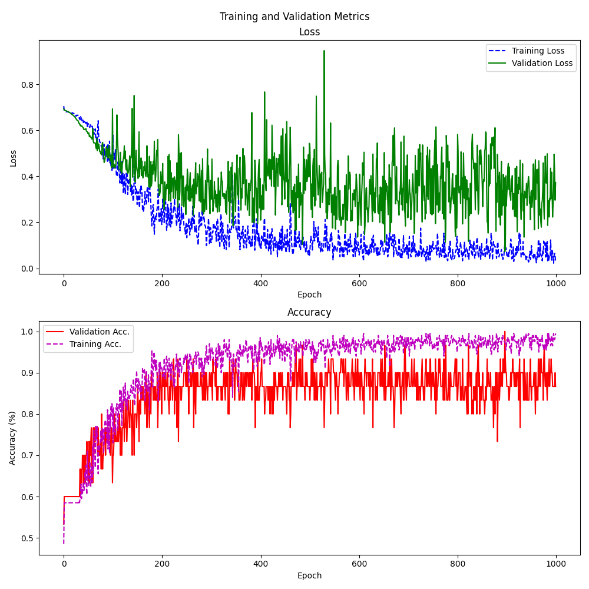

# Cell Behavior Video Classification Challenge (CBVCC)

Repository of TrajNet for analyzing and classifying cell behavior in intravital microscopy videos. It performs cell segmentation, tracking, and classification using a combination of custom deep learning models.

## Installation

### Prerequisites
- CUDA-capable GPU (recommended)
- Conda package manager

### Setup Environment

1. Clone the repository:
```bash
git clone https://github.com/lxfhfut/TrajNet.git
cd TrajNet
```

2. Create and activate the conda environment (cbvcc.yml for MacOS, cbvcc_linux.yml for Linux):
```bash
conda env create -f cbvcc.yml
conda activate cbvcc
```

## Usage

The program supports three modes of operation: train, evaluate, and predict.

### Training Mode

Train a new model on your dataset:

```bash
python main.py train \
    --root_dir ./dataset \
    --ckpt_dir ./models \
    --segmenter cy_retrained \
    --batch_size 32
```

Parameters:
- `--root_dir`: Directory containing training videos and annotations
- `--ckpt_dir`: Directory to save model checkpoints (default: ./ckpts)
- `--segmenter`: Cellpose model for segmentation (default: cyto_retrained)
- `--batch_size`: Training batch size (default: 32)


## Expected Directory Structure

```
dataset/
│── imgs/
│   └── 00_1/
│       ├── 000000.png
│       ├── 000001.png
│            ...
│       └── 000019.png
│   └── 00_2/
├── trks/
│   └── cyto_retrained/
│       ├── 00_1/
│       │   ├── video1_imgs.tif
│       │   ├── video1_msks.tif
│       │   └── video1_track_trajectories.csv
│       └── 00_2/
├── test_phase1.csv
└── train.csv
```



### Evaluation Mode

Evaluate model performance on a test dataset:

```bash
python main.py evaluate \
    --root_dir ./dataset \
    --model_path ./models/best_model.pt \
    --save_dir ./results \
    --segmenter cyto_retrained \
    --batch_size 4
```

Parameters:
- `--root_dir`: Directory containing frames of videos to be evaluated
- `--model_path`: Path to trained model checkpoint. All model checkpoints will be used if it is a directory.
- `--save_dir`: Directory to save evaluation results (default: ./results)
- `--segmenter`: Cellpose model for segmentation (default: cyto_retrained)
- `--batch_size`: Evaluation batch size (default: 4)

### Predict Mode (Single Video)

Predict the class labels for videos in predict.csv under root_dir:

```bash
python main.py predict \
    --root_dir /path/to/video.avi \
    --model_path ./models/best_model.pt \
    --save_dir ./results \
    --segmenter cytotorch_0
```

Parameters:
- `--root_dir`: Directory containing frames of videos to be predicted
- `--model_path`: Path to model used for prediction. All models will be used if it is a directory.
- `--save_dir`: Directory to save prediction results. It is a csv file ready for uploading to leaderboard.
- `--segmenter`: Cellpose model for segmentation (default: cyto_retrained)
Note that the 'action_label' column in the predict.csv is set to 0 before prediction.
## Notes

- The default segmentation model is 'cyto_retrained'. It is a cellpose model based on the "cytotorch_0" pretrained model and was retrained on the **Training** set of this challenge. Note that we did not the videos of test_phase1 and test_phase2 for retraining the segmentation model.
- GPU acceleration is automatically used if available.
